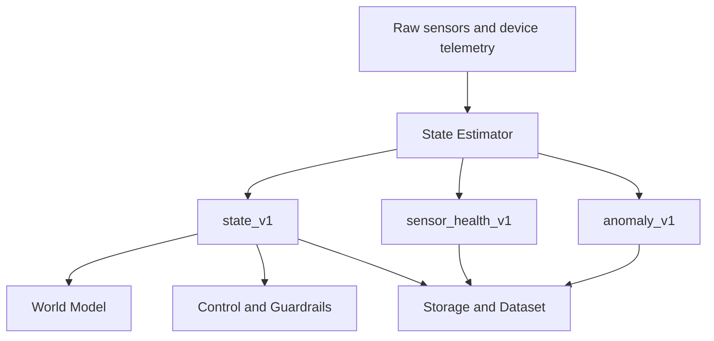
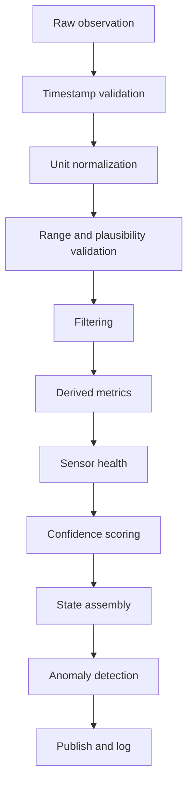

# Senior Pomidor State Estimator Specification

Version: 1.0  
Date: 2026-07-02  
Project: Senior Pomidor v0.1  
Status: implementation-ready MVP specification

---

## 1. Purpose

The State Estimator converts raw telemetry from the physical plant system into a stable, versioned, biologically meaningful `state_v1` object.

It is the first reasoning layer after sensing. It does not choose actions and it does not control actuators. Its job is to answer:

- What is the current environment, plant, soil, device and budget state?
- Which values are derived from raw sensors?
- Which sensors are trusted, degraded, missing, stale or failed?
- Which anomalies are present now?
- Is the resulting state safe enough for downstream autonomy?

The State Estimator feeds:

- `world_model`
- `weather_adapter`
- `control`
- `guardrails`
- dashboard
- JSONL datasets
- public transparency logs

---

## 2. Architectural Position



Canonical pipeline:



---

## 3. Scope

### In Scope

- Normalize raw readings into canonical units.
- Validate timestamps, freshness, ranges and rate of change.
- Filter short-term noise.
- Compute derived metrics such as VPD, dew point, leaf-air delta and soil aggregates.
- Maintain short-term history for filtering, rate checks and health checks.
- Compute per-sensor confidence and aggregate state confidence.
- Detect sensor health problems.
- Detect environment, plant, soil and telemetry anomalies.
- Publish and persist `state_v1`, `sensor_health_v1`, `anomaly_v1` and diagnostics.

### Out of Scope

- Selecting actions.
- Applying guardrails to candidate actions.
- Fetching external weather forecasts.
- Forecasting future plant/environment dynamics.
- Running computer vision on raw images.
- Direct actuator control.

The LLM/vision layer may provide a strict `vision_v1` summary, but the State Estimator treats it as another input signal, not as raw image data.

---

## 4. Source Alignment

This specification consolidates and completes the State Estimator requirements from the project documents:

- `TECHNICAL_SPECIFICATION.md`
- `scientific_review_tomato_austria_sensors_v_1_3_arch_aligned.md`
- `scientific_review_tomato_austria_sensors_v_1_2_en.md`
- `senior_pomidor_architecture_diagram_v_1.md`
- `weather_adapter_integration_design_en.md`
- `vienna_balcony_tomato_schedule_sensor_aligned.md`
- `plant_observation_dataset_spec_en.md`
- `mini_greenhouse_node_architecture_en.md`
- `raspberry_pi_mini_greenhouse_module_spec_en.md`

External compatibility check:

- GeoSphere Austria Dataset API still uses the `https://dataset.api.hub.geosphere.at` host and `v1` endpoint structure as of the current online documentation.
- Public GeoSphere datasets are documented as Creative Commons Attribution 4.0 licensed when accessible without authentication.

---

## 5. Core Design Decisions

| Area | Decision |
|---|---|
| Canonical schema | Use nested `state_v1.env`, `state_v1.plant`, `state_v1.soil`, `state_v1.devices`, `state_v1.budgets`, `state_v1.quality`. |
| Legacy flat schema | Supported only through an input/output adapter during migration. It is not canonical. |
| MVP filtering | Median-of-3 followed by EMA for noisy numeric sensors. No Kalman filter in MVP. |
| State cadence | Produce private operational `state_v1` every 60 seconds when telemetry is available. |
| Sensor polling | Default raw polling every 30 seconds. |
| Public logging | Public state logs may be downsampled to 30 minutes plus anomalies. |
| Decision cadence | Downstream control may run every 2 hours plus event-driven anomaly cycles. |
| Timezone | Store timestamps with timezone. Default project timezone: `Europe/Vienna`. |
| Missing sensors | Represent unavailable values as `null`; never invent sensor values. |
| Confidence | Numeric `0.0..1.0`, plus categorical quality derived from the numeric value. |
| Optional sensors | Missing optional sensors reduce only the relevant field confidence, not the whole state unless downstream logic requires them. |
| Required sensors | Missing required sensors degrade aggregate state confidence and may make autonomy unsafe. |

---

## 6. Inputs

### 6.1 Raw Sensor Observation

Raw sensor observations are accepted from local node services, MQTT, Redis Streams, NATS, HTTP ingestion or file replay. The transport is not part of the contract; the payload is.

```json
{
  "schema_version": "raw_observation_v1",
  "node_id": "balcony_node_01",
  "sensor_id": "air_sht31_01",
  "sensor_type": "air_temp_rh",
  "ts": "2026-07-02T10:00:30+02:00",
  "received_ts": "2026-07-02T10:00:31+02:00",
  "values": {
    "air_temp_c": 24.3,
    "rh_pct": 61.7
  },
  "raw": {
    "temperature": 24.3,
    "humidity": 61.7
  },
  "unit": "canonical",
  "read_ok": true,
  "error": null
}
```

Required fields:

| Field | Type | Rule |
|---|---:|---|
| `schema_version` | string | Must equal `raw_observation_v1` for MVP. |
| `node_id` | string | Stable node identifier. |
| `sensor_id` | string | Stable physical or logical sensor identifier. |
| `sensor_type` | string | One of the configured sensor types. |
| `ts` | RFC3339 string | Sensor timestamp or acquisition timestamp. |
| `received_ts` | RFC3339 string | Server/node receipt timestamp. |
| `values` | object | Raw or canonical numeric values. |
| `read_ok` | boolean | False if read failed. |

### 6.2 Supported MVP Sensor Types

| Sensor Type | Canonical Fields | Required for MVP |
|---|---|---:|
| `air_temp_rh` | `air_temp_c`, `rh_pct` | yes |
| `soil_moisture` | `moisture_pct` | yes, at least one probe |
| `soil_temp` | `soil_temp_c` | recommended |
| `leaf_ir` | `leaf_temp_c` | optional |
| `co2` | `co2_ppm` | optional |
| `light_lux` | `lux` | recommended |
| `light_ppfd` | `ppfd_umol_m2_s` | optional |
| `device_status` | device state fields | yes |
| `budget_status` | budget fields | required before real actuator control |

### 6.3 Device Telemetry

```json
{
  "schema_version": "device_telemetry_v1",
  "node_id": "balcony_node_01",
  "ts": "2026-07-02T10:00:30+02:00",
  "devices": {
    "light": "OFF",
    "circulation_fan": "ON",
    "exhaust_fan": "OFF",
    "humidifier": "OFF",
    "heater_mat": "OFF",
    "water_pump": "OFF",
    "co2_solenoid": "OFF",
    "mcu_connected": true,
    "last_reset_ts": "2026-07-02T06:02:10+02:00"
  }
}
```

Allowed device states:

- `ON`
- `OFF`
- `UNKNOWN`
- `FAULT`

### 6.4 Vision Summary Input

The State Estimator accepts a vision summary only after it has been validated against `vision_v1`.

```json
{
  "schema_version": "vision_v1",
  "ts": "2026-07-02T10:00:00+02:00",
  "source": "camera_main",
  "leaf_color": "green",
  "wilting": false,
  "pest_signs": "none",
  "fruit_count_est": 3,
  "flower_count_est": 7,
  "stress_score": 0.10,
  "notes": "dense canopy, no wilting",
  "confidence": 0.65
}
```

The estimator must not parse free text from the LLM as control-critical data. Only validated fields are used.

### 6.5 Context Input

```json
{
  "schema_version": "context_v1",
  "node_id": "balcony_node_01",
  "timezone": "Europe/Vienna",
  "growth_stage": "fruiting",
  "mode": "normal",
  "location_type": "balcony",
  "is_outdoor": true,
  "calibration_profile_id": "balcony_node_01_2026_season"
}
```

Allowed `growth_stage` values:

- `germination`
- `seedling`
- `vegetative`
- `flowering`
- `fruiting`
- `ripening`
- `unknown`

Allowed `mode` values:

- `normal`
- `flavor`
- `recovery`
- `maintenance`

---

## 7. Time Policy

### 7.1 Timestamp Rules

All timestamps must be parsed as timezone-aware RFC3339 strings. Naive timestamps are rejected unless a configured ingestion adapter explicitly assigns `Europe/Vienna`.

The estimator stores:

- `ts`: state timestamp, rounded to the nearest second.
- `window_start_ts`: start of observations used for the state.
- `window_end_ts`: end of observations used for the state.
- `generated_ts`: time when state was generated.

### 7.2 State Assembly Window

Default MVP window:

- `state_period_seconds`: 60
- `collection_window_seconds`: 90
- `max_sensor_age_seconds`: 120
- `max_device_age_seconds`: 120
- `max_vision_age_seconds`: 7200

At each state tick, the estimator selects the newest valid reading per sensor within the collection window. If no reading exists but a recent reading exists within `max_sensor_age_seconds`, it may be carried forward with freshness penalty.

If a required reading is older than `max_sensor_age_seconds`, the value becomes `null`, the sensor is marked `STALE` or `DISCONNECTED`, and confidence drops.

### 7.3 Event-Driven Sampling

The estimator may request increased sampling by publishing `sampling_hint_v1` when anomalies or suspicious trends are detected.

Default hints:

| Condition | Sampling Hint |
|---|---:|
| `HIGH_VPD`, `HIGH_TEMP`, `LEAF_STRESS` | 5 minutes for 1 hour |
| `SENSOR_JUMP`, `SENSOR_STALE` | 30 seconds for 15 minutes |
| `CRITICAL_HEAT`, `DEVICE_DISCONNECTED` | 30 seconds until cleared |

The scheduler decides how to apply the hint.

---

## 8. Unit Normalization

Canonical units:

| Field | Canonical Unit |
|---|---|
| air temperature | `deg C` |
| relative humidity | `%` |
| VPD | `kPa` |
| CO2 | `ppm` |
| soil temperature | `deg C` |
| soil moisture | calibrated sensor `%`, `0..100` |
| leaf temperature | `deg C` |
| light | `lux` or `umol/m2/s` |
| DLI | `mol/m2/day` |
| water | `ml` |
| time budget | `seconds` |

Conversion rules:

- Fahrenheit input must be converted to Celsius before validation.
- RH fractions `0..1` must be converted to percent only if the sensor adapter declares this format.
- Soil moisture ADC values must be converted through the configured calibration profile.
- Unknown units are rejected and logged as `UNIT_UNKNOWN`.

---

## 9. Calibration

### 9.1 Calibration Profile

```json
{
  "schema_version": "calibration_profile_v1",
  "profile_id": "balcony_node_01_2026_season",
  "node_id": "balcony_node_01",
  "soil_probes": {
    "P1": {
      "position": "top",
      "air_adc": 820,
      "water_adc": 350,
      "dry_threshold_pct": 18.0,
      "wet_threshold_pct": 70.0
    },
    "P2": {
      "position": "bottom",
      "air_adc": 815,
      "water_adc": 340,
      "dry_threshold_pct": 22.0,
      "wet_threshold_pct": 75.0
    }
  },
  "sensor_offsets": {
    "air_sht31_01.air_temp_c": 0.0,
    "air_sht31_01.rh_pct": 0.0,
    "leaf_ir_01.leaf_temp_c": 0.0
  }
}
```

### 9.2 Soil Moisture Conversion

For capacitive or resistive probes with ADC values:

```text
moisture_pct = 100 * (air_adc - current_adc) / (air_adc - water_adc)
```

Clamp only after recording the unclamped value in diagnostics:

```text
moisture_pct = min(100, max(0, moisture_pct))
```

If a probe has no calibration profile:

- emit `SOIL_PROBE_UNCALIBRATED`
- set `moisture_pct` to `null` unless the adapter already provides calibrated `%`
- set probe confidence <= `0.30`

---

## 10. Validation

Validation separates physical plausibility from biological target ranges.

### 10.1 Hard Plausibility Ranges

Values outside hard range are invalid and must not be used for derived metrics.

| Field | Hard Range |
|---|---:|
| `air_temp_c` | `-20..60` |
| `rh_pct` | `0..100` |
| `co2_ppm` | `0..5000` |
| `soil_temp_c` | `-10..50` |
| `moisture_pct` | `0..100` |
| `leaf_temp_c` | `-20..70` |
| `lux` | `0..150000` |
| `ppfd_umol_m2_s` | `0..2500` |

### 10.2 Biological Target and Risk Ranges

These ranges are used for anomaly detection, not for rejecting raw sensor values.

| Metric | Target | Risk |
|---|---:|---:|
| `env.air_temp_c` day | `22..26` | `>32` heat stress |
| `env.air_temp_c` night | `17..19` | `<12` lower physiological limit |
| `env.rh_pct` | `60..75` | `>85` disease/condensation risk |
| `env.vpd_kpa` | `0.8..1.3` | `>1.6` water stress, `<0.5` condensation/disease risk |
| `env.co2_ppm` in light | `800..1000` | `>1500` excessive |
| `soil.temp_c` | `18..22` | `<15` or `>28` |
| `plant.leaf_air_delta_c` | `-2..2` | absolute value `>3` |
| `soil.probes[].moisture_pct` | calibrated | below probe-specific dry threshold |

Growth-stage adjustments:

| Stage | VPD Target |
|---|---:|
| `germination` | `0.6..1.0` |
| `seedling` | `0.8..1.1` |
| `vegetative` | `0.8..1.3` |
| `flowering` | `0.9..1.2` |
| `fruiting` | `0.8..1.3` |
| `ripening` / `flavor` | `1.1..1.3` |

### 10.3 Rate-of-Change Validation

Rate checks flag suspicious changes. They do not automatically invalidate a value unless the jump exceeds the hard jump limit.

Default limits:

| Field | Warn Delta | Hard Jump | Window |
|---|---:|---:|---:|
| `air_temp_c` | `2.0 deg C` | `5.0 deg C` | 1 min |
| `rh_pct` | `10 pct points` | `20 pct points` | 1 min |
| `vpd_kpa` | `0.30` | `0.60` | 1 min |
| `soil_temp_c` | `0.5 deg C` | `1.0 deg C` | 1 min |
| `moisture_pct` without watering | `5 pct points` | `15 pct points` | 1 min |
| `moisture_pct` after watering | `20 pct points` | `40 pct points` | 1 min |
| `co2_ppm` without injection | `300 ppm` | `700 ppm` | 1 min |
| `co2_ppm` with injection | `1000 ppm` | `2500 ppm` | 1 min |
| `leaf_temp_c` | `2.0 deg C` | `5.0 deg C` | 1 min |

Light can change rapidly due to sun, shade and lamp switching. Validate light with range and context, not with a strict default jump rule.

---

## 11. Filtering

### 11.1 MVP Filter

For each numeric sensor stream:

1. Reject invalid hard-range values.
2. Apply median-of-3 to remove single-sample spikes.
3. Apply EMA to smooth short-term noise.

Default EMA:

```text
filtered_t = alpha * median_t + (1 - alpha) * filtered_t-1
```

Default `alpha`:

| Field Group | Alpha |
|---|---:|
| air temperature | `0.30` |
| RH | `0.35` |
| CO2 | `0.40` |
| soil moisture | `0.20` |
| soil temperature | `0.20` |
| leaf temperature | `0.40` |
| light | `0.50` |

### 11.2 When Not to Smooth

Do not smooth:

- device states
- boolean statuses
- counters/budgets
- timestamps
- already aggregated vision outputs

### 11.3 Filter Diagnostics

For each filtered value, keep diagnostics:

```json
{
  "raw_value": 61.7,
  "median_value": 61.5,
  "filtered_value": 61.4,
  "filter": "median3_ema",
  "alpha": 0.35,
  "flags": []
}
```

---

## 12. Derived Metrics

Derived metrics must be deterministic and unit-tested.

### 12.1 Vapor Pressure

Saturated vapor pressure:

```text
Es(T) = 0.6108 * exp((17.27 * T) / (T + 237.3))
```

Actual vapor pressure:

```text
Ea = Es(air_temp_c) * (rh_pct / 100)
```

Air VPD:

```text
air_vpd_kpa = Es(air_temp_c) - Ea
```

State field:

```text
env.vpd_kpa = air_vpd_kpa
```

Leaf-side VPD, if leaf temperature is available:

```text
leaf_saturation_vapor_pressure_kpa = Es(leaf_temp_c)
leaf_vpd_kpa = leaf_saturation_vapor_pressure_kpa - Ea
```

### 12.2 Dew Point

```text
gamma = ln(rh_pct / 100) + (17.27 * air_temp_c) / (237.3 + air_temp_c)
dew_point_c = (237.3 * gamma) / (17.27 - gamma)
```

### 12.3 Absolute Humidity

```text
actual_vapor_pressure_hpa = air_actual_vapor_pressure_kpa * 10
absolute_humidity_g_m3 = 216.7 * actual_vapor_pressure_hpa / (air_temp_c + 273.15)
```

### 12.4 Leaf-Air Delta

```text
leaf_air_delta_c = leaf_temp_c - air_temp_c
```

Positive values mean the leaf is warmer than the air. Negative values mean the leaf is cooler than the air.

### 12.5 Soil Aggregates

For valid calibrated probes:

```text
avg_moisture_pct = confidence_weighted_average(probes[].moisture_pct)
```

If probe position is known:

```text
top_bottom_gradient_pct = top_probe.moisture_pct - bottom_probe.moisture_pct
```

Zone pattern:

| Pattern | Condition |
|---|---|
| `uniform` | all valid probes are within 10 pct points |
| `top_dry` | top probe below dry threshold, bottom not dry |
| `bottom_dry` | bottom probe below dry threshold |
| `two_zone` | top-bottom difference >= 20 pct points |
| `unknown` | fewer than 2 valid probes |

### 12.6 Drying Rate

For each probe and aggregate soil moisture:

```text
drying_rate_pct_per_hour = (moisture_now - moisture_past) / hours_elapsed
```

Use a 3 to 6 hour window by default. Do not compute drying rate across watering events unless the output is explicitly marked `post_watering_recovery`.

### 12.7 DLI

If PPFD is available:

```text
dli_mol_m2_day = sum(ppfd_umol_m2_s * seconds_interval) / 1_000_000
```

If only lux is available, the estimator may expose `light_proxy_lux` but must not pretend that DLI is measured.

---

## 13. Sensor Health

### 13.1 Health Status Values

| Status | Meaning |
|---|---|
| `OK` | Sensor is fresh, plausible and consistent. |
| `WARN` | Suspicious but still usable with reduced confidence. |
| `STALE` | No fresh reading within configured age. |
| `DISCONNECTED` | Read failure or no data for disconnect timeout. |
| `OUT_OF_RANGE` | Outside hard plausibility range. |
| `JUMP` | Rate-of-change exceeds hard jump limit. |
| `STUCK` | Value is flat beyond configured duration. |
| `DRIFT` | Slowly diverges from related sensors or expected baseline. |
| `UNCALIBRATED` | Sensor requires calibration before meaningful use. |
| `NOT_PRESENT` | Sensor is not installed in this node. |
| `UNKNOWN` | Insufficient history to classify. |

### 13.2 Sensor Health Contract

```json
{
  "schema_version": "sensor_health_v1",
  "ts": "2026-07-02T10:01:00+02:00",
  "node_id": "balcony_node_01",
  "overall_status": "WARN",
  "sensors": [
    {
      "sensor_id": "soil_probe_p1",
      "sensor_type": "soil_moisture",
      "status": "OK",
      "confidence": 0.82,
      "last_seen_ts": "2026-07-02T10:00:30+02:00",
      "age_seconds": 30,
      "flags": [],
      "reason": null
    },
    {
      "sensor_id": "co2_01",
      "sensor_type": "co2",
      "status": "NOT_PRESENT",
      "confidence": 0.0,
      "last_seen_ts": null,
      "age_seconds": null,
      "flags": ["optional_sensor_missing"],
      "reason": "CO2 sensor is not installed on this node"
    }
  ]
}
```

### 13.3 Stuck Detection

Default stuck rules:

| Sensor | Rule |
|---|---|
| air temperature | stddev `<0.02 deg C` for 2h and at least 20 samples |
| RH | stddev `<0.05 pct points` for 2h and at least 20 samples |
| soil moisture | exact same value for 6h, or stddev `<0.01` for 12h |
| CO2 | exact same value for 1h while ventilation/light context changes |
| leaf temperature | stddev `<0.02 deg C` for 1h during changing light/air temp |

Stuck detection should be conservative. Many low-cost sensors quantize output, so `STUCK` should normally start as `WARN` before becoming `DISCONNECTED` or `FAILED`.

### 13.4 Drift Detection

MVP drift detection:

- Compare redundant air temperature/RH sensors if present.
- Compare leaf temperature with air temperature under stable low-light conditions.
- Compare soil probes after full watering events.
- Compare slowly changing sensor offset against a 24h rolling baseline.

Default drift flags:

| Condition | Flag |
|---|---|
| redundant temperature sensors differ by `>2 deg C` for 30 min | `TEMP_SENSOR_DIVERGENCE` |
| redundant RH sensors differ by `>8 pct points` for 30 min | `RH_SENSOR_DIVERGENCE` |
| leaf-air delta absolute value `>5 deg C` for 30 min without matching stress context | `LEAF_SENSOR_SUSPECT` |
| soil probe remains dry after confirmed watering while other probes respond | `SOIL_PROBE_SUSPECT` |

---

## 14. Confidence

### 14.1 Numeric Confidence

Every sensor-derived field receives confidence `0.0..1.0`.

Default score:

```text
confidence =
  0.20 * presence_score +
  0.20 * range_score +
  0.20 * freshness_score +
  0.15 * rate_score +
  0.10 * history_score +
  0.15 * consistency_score
```

Scores:

| Score | Meaning |
|---|---|
| `presence_score` | Reading exists and read was successful. |
| `range_score` | Reading is inside hard plausibility range. |
| `freshness_score` | Reading age is below freshness limits. |
| `rate_score` | Rate of change is plausible. |
| `history_score` | Enough recent history exists and no stuck/drift pattern is present. |
| `consistency_score` | Related sensors agree, or consistency is not applicable. |

If a component is not applicable, assign `1.0` for that component unless the sensor is required for the specific derived metric.

### 14.2 Confidence Categories

| Numeric Range | Category |
|---|---|
| `>=0.85` | `HIGH` |
| `0.65..0.849` | `MEDIUM` |
| `0.40..0.649` | `LOW` |
| `<0.40` | `UNTRUSTED` |

### 14.3 Derived Metric Confidence

Derived metric confidence is the minimum or weighted product of input confidences.

Default:

```text
vpd_confidence = min(air_temp_confidence, rh_confidence)
leaf_air_delta_confidence = min(leaf_temp_confidence, air_temp_confidence)
soil_avg_confidence = confidence_weighted_mean(valid_probe_confidences)
```

Do not compute a derived metric when required inputs are invalid. Use `null`.

### 14.4 Aggregate State Confidence

Required MVP groups:

- air temperature/RH
- at least one soil moisture probe
- device connectivity

Aggregate:

```text
state_confidence =
  0.35 * env_confidence +
  0.30 * soil_confidence +
  0.20 * device_confidence +
  0.10 * plant_confidence +
  0.05 * budget_confidence
```

If an optional group is absent, its weight is redistributed to required groups unless the current downstream mode requires it.

State quality:

| State Confidence | `quality.level` | Meaning |
|---|---|---|
| `>=0.85` | `GOOD` | Safe for normal downstream reasoning. |
| `0.65..0.849` | `DEGRADED` | Usable, but downstream control should be cautious. |
| `0.40..0.649` | `LOW_CONFIDENCE` | Avoid non-essential autonomous actions. |
| `<0.40` | `UNSAFE_FOR_AUTONOMY` | Guardrails should block risky actions. |

---

## 15. Missing Sensor Policy

### 15.1 Required Sensor Missing

If a required sensor is missing or stale:

- field value is `null`
- field confidence is `0.0`
- sensor health is `STALE`, `DISCONNECTED` or `NOT_PRESENT`
- aggregate state confidence is reduced
- emit anomaly `REQUIRED_SENSOR_UNAVAILABLE`
- downstream autonomy should be blocked if confidence falls below threshold

### 15.2 Optional Sensor Missing

If an optional sensor is missing:

- field value is `null`
- field confidence is `0.0`
- sensor health is `NOT_PRESENT`
- no anomaly is emitted unless the system config says the sensor is installed
- derived metrics depending on it are `null`

Examples:

| Missing Input | Result |
|---|---|
| CO2 sensor absent | `env.co2_ppm = null`; no CO2-based anomalies; CO2 control disabled by guardrails. |
| Leaf IR absent | `plant.leaf_temp_c = null`; `plant.leaf_air_delta_c = null`; no `LEAF_STRESS` anomaly from IR. |
| Bottom soil probe absent | `soil.zone_pattern = "unknown"` unless at least 2 probes exist. |
| Vision absent | `plant.vision = null`; plant visual confidence ignored for aggregate unless mode requires vision. |

### 15.3 Never Impute Control-Critical Values

The estimator must not fill missing control-critical values using a model unless the field is explicitly marked as estimated:

```json
{
  "value": 24.1,
  "source": "estimated_from_history",
  "confidence": 0.30
}
```

MVP recommendation: avoid estimated substitutions in `state_v1`; keep values `null` and let downstream layers degrade safely.

---

## 16. Canonical Output: `state_v1`

### 16.1 Example

```json
{
  "schema_version": "state_v1",
  "state_id": "state_2026-07-02T10:01:00+02:00_balcony_node_01",
  "node_id": "balcony_node_01",
  "ts": "2026-07-02T10:01:00+02:00",
  "window_start_ts": "2026-07-02T09:59:30+02:00",
  "window_end_ts": "2026-07-02T10:01:00+02:00",
  "generated_ts": "2026-07-02T10:01:01+02:00",
  "context": {
    "timezone": "Europe/Vienna",
    "growth_stage": "fruiting",
    "mode": "normal",
    "is_day": true,
    "is_outdoor": true
  },
  "env": {
    "air_temp_c": 24.3,
    "rh_pct": 61.7,
    "co2_ppm": null,
    "lux": 14500.0,
    "ppfd_umol_m2_s": null,
    "air_saturation_vapor_pressure_kpa": 3.03,
    "air_actual_vapor_pressure_kpa": 1.87,
    "vpd_kpa": 1.16,
    "dew_point_c": 16.6,
    "absolute_humidity_g_m3": 13.7
  },
  "plant": {
    "leaf_temp_c": 23.7,
    "leaf_air_delta_c": -0.6,
    "leaf_saturation_vapor_pressure_kpa": 2.92,
    "leaf_vpd_kpa": 1.05,
    "vision": {
      "source": "camera_main",
      "summary": "dense canopy, no wilting",
      "stress_score": 0.10,
      "fruit_count_est": 3,
      "flower_count_est": 7,
      "confidence": 0.65
    }
  },
  "soil": {
    "temp_c": 19.7,
    "probes": [
      {
        "id": "P1",
        "position": "top",
        "moisture_pct": 28.6,
        "dry_threshold_pct": 18.0,
        "confidence": 0.82,
        "status": "OK"
      },
      {
        "id": "P2",
        "position": "bottom",
        "moisture_pct": 49.2,
        "dry_threshold_pct": 22.0,
        "confidence": 0.85,
        "status": "OK"
      }
    ],
    "avg_moisture_pct": 39.0,
    "top_bottom_gradient_pct": -20.6,
    "zone_pattern": "two_zone",
    "drying_rate_pct_per_hour": -1.2
  },
  "devices": {
    "light": "OFF",
    "circulation_fan": "ON",
    "exhaust_fan": "OFF",
    "humidifier": "OFF",
    "heater_mat": "OFF",
    "water_pump": "OFF",
    "co2_solenoid": "OFF",
    "mcu_connected": true,
    "last_reset_ts": "2026-07-02T06:02:10+02:00"
  },
  "budgets": {
    "water_ml_used_today": 1600,
    "water_ml_budget_today": 2200,
    "co2_seconds_used_today": 0,
    "co2_seconds_budget_today": 0
  },
  "quality": {
    "level": "GOOD",
    "state_confidence": 0.86,
    "env_confidence": 0.91,
    "soil_confidence": 0.84,
    "plant_confidence": 0.72,
    "device_confidence": 1.0,
    "budget_confidence": 0.90,
    "flags": ["co2_sensor_not_present"]
  },
  "refs": {
    "sensor_health_id": "sensor_health_2026-07-02T10:01:00+02:00_balcony_node_01",
    "anomaly_ids": []
  }
}
```

### 16.2 Field Requirements

Required top-level fields:

- `schema_version`
- `state_id`
- `node_id`
- `ts`
- `generated_ts`
- `context`
- `env`
- `soil`
- `devices`
- `quality`

Optional but recommended:

- `plant`
- `budgets`
- `refs`

Fields may be `null` when a sensor is not available. Do not omit canonical fields solely because the current value is unknown.

---

## 17. Anomaly Detection

### 17.1 Anomaly Contract

```json
{
  "schema_version": "anomaly_v1",
  "anomaly_id": "anom_2026-07-02T13:17:00+02:00_HIGH_VPD",
  "node_id": "balcony_node_01",
  "ts": "2026-07-02T13:17:00+02:00",
  "state_id": "state_2026-07-02T13:17:00+02:00_balcony_node_01",
  "severity": "WARN",
  "type": "HIGH_VPD",
  "status": "ACTIVE",
  "signals": {
    "env.vpd_kpa": 1.72,
    "env.air_temp_c": 30.1,
    "env.rh_pct": 43.0
  },
  "duration_seconds": 600,
  "expected_effects": ["increased_transpiration", "faster_soil_drying"],
  "required_response": ["increase_sampling", "capture_image", "notify_if_persistent"],
  "confidence": 0.88
}
```

Severity values:

- `INFO`
- `WARN`
- `HIGH`
- `CRITICAL`

Status values:

- `ACTIVE`
- `CLEARED`
- `SUPPRESSED`

### 17.2 MVP Anomaly Rules

| Type | Severity | Condition | Duration | Required Response |
|---|---|---|---:|---|
| `HIGH_TEMP` | `WARN` | `env.air_temp_c > 30` | 10 min | increase sampling, log |
| `CRITICAL_HEAT` | `CRITICAL` | `env.air_temp_c > 32` | 2 min | notify, increase sampling, guardrails safe mode |
| `LOW_TEMP` | `WARN` | `env.air_temp_c < 15` | 10 min | notify if persistent |
| `CRITICAL_COLD` | `HIGH` | `env.air_temp_c < 12` | 2 min | notify, safe mode |
| `HIGH_RH` | `WARN` | `env.rh_pct > 85` | 15 min | increase sampling, condensation watch |
| `SATURATION_RH` | `HIGH` | `env.rh_pct >= 98` | 5 min | notify, camera snapshot |
| `HIGH_VPD` | `WARN` | `env.vpd_kpa > 1.6` | 10 min | increase sampling, camera snapshot |
| `LOW_VPD` | `WARN` | `env.vpd_kpa < 0.5` | 15 min | condensation/disease watch |
| `LEAF_STRESS` | `WARN` | `abs(plant.leaf_air_delta_c) > 3` | 5 min | camera snapshot, increase sampling |
| `SOIL_TEMP_LOW` | `WARN` | `soil.temp_c < 15` | 15 min | log, notify if persistent |
| `SOIL_TEMP_HIGH` | `WARN` | `soil.temp_c > 28` | 15 min | log, notify if persistent |
| `TOP_DRYING` | `WARN` | top probe below calibrated dry threshold | 10 min | mark water stress risk |
| `BOTTOM_DRY` | `HIGH` | bottom probe below calibrated dry threshold | 10 min | notify, guardrails caution |
| `RAPID_SOIL_DRYING` | `WARN` | drying rate below configured negative threshold | 30 min | increase sampling |
| `SENSOR_STALE` | `WARN` | required sensor older than max age | immediate | increase sampling, notify if persistent |
| `SENSOR_DISCONNECTED` | `HIGH` | required sensor missing for disconnect timeout | 5 min | notify, safe mode for affected actions |
| `SENSOR_JUMP` | `WARN` | hard jump exceeded | immediate | distrust reading, increase sampling |
| `SENSOR_STUCK` | `WARN` | stuck rule triggered | configured | reduce confidence |
| `DEVICE_DISCONNECTED` | `HIGH` | `devices.mcu_connected = false` | immediate | block actuator autonomy |
| `LOW_STATE_CONFIDENCE` | `HIGH` | `quality.state_confidence < 0.40` | immediate | block risky autonomy |

### 17.3 Hysteresis and Clearing

To avoid alert flapping:

- WARN anomalies clear only after the signal remains normal for 2 consecutive state cycles.
- HIGH and CRITICAL anomalies clear only after 5 minutes of normal readings, unless manually acknowledged.
- Sensor anomalies clear after a successful fresh valid reading and one additional confirmation reading.

### 17.4 Anomaly Deduplication

Do not emit a new anomaly every state tick for the same active condition. Update the existing active anomaly with:

- `last_seen_ts`
- `duration_seconds`
- latest `signals`
- latest `confidence`

Emit a `CLEARED` record when the anomaly clears.

---

## 18. Internal State Model

Recommended internal structures:

```text
RawObservation
NormalizedObservation
ValidatedObservation
FilteredObservation
DerivedMetrics
SensorHealthSnapshot
ConfidenceSnapshot
StateV1
AnomalyV1[]
EstimatorDiagnostics
```

The estimator must keep:

- last 48 hours of `state_v1` history
- last 48 hours of sensor health snapshots
- enough raw/filtered history for replay/debugging
- active anomaly registry

History may be implemented as:

- in-memory ring buffer for online operation
- JSONL/SQLite for persistence and replay

---

## 19. Logging and Storage

### 19.1 Private Logs

Recommended private layout:

```text
/data/private/
  raw_observations_YYYY-MM-DD.jsonl
  filtered_observations_YYYY-MM-DD.jsonl
  states_YYYY-MM.jsonl
  sensor_health_YYYY-MM.jsonl
  anomalies_YYYY-MM.jsonl
  estimator_diagnostics_YYYY-MM-DD.jsonl
```

### 19.2 Public Logs

Recommended public layout:

```text
/data/public/
  states_public_YYYY-MM.jsonl
  anomalies_public_YYYY-MM.jsonl
```

Public state may be downsampled to:

- every 30 minutes
- every anomaly start/update/clear
- every action-relevant state

### 19.3 JSONL Rules

Each line is one complete JSON object.

Required common fields:

- `schema_version`
- `node_id`
- `ts`
- stable id field, such as `state_id` or `anomaly_id`

Do not store secrets, exact private address, API keys or private network credentials in public logs.

### 19.4 Replay Determinism

Given the same:

- raw observations
- calibration profile
- context
- estimator config
- code version

the estimator must produce identical `state_v1` and `anomaly_v1` outputs.

Include versions in diagnostics:

```json
{
  "schema_version": "estimator_diagnostics_v1",
  "ts": "2026-07-02T10:01:00+02:00",
  "state_id": "state_2026-07-02T10:01:00+02:00_balcony_node_01",
  "estimator_version": "0.1.0",
  "config_version": "state_estimator_config_v1",
  "calibration_profile_id": "balcony_node_01_2026_season",
  "input_count": 8,
  "invalid_input_count": 0,
  "processing_ms": 14
}
```

---

## 20. Interfaces

### 20.1 Event Topics

Suggested topics:

| Topic | Direction | Payload |
|---|---|---|
| `sensor.raw.v1` | input | `raw_observation_v1` |
| `device.telemetry.v1` | input | `device_telemetry_v1` |
| `vision.summary.v1` | input | `vision_v1` |
| `context.v1` | input | `context_v1` |
| `state.v1` | output | `state_v1` |
| `sensor_health.v1` | output | `sensor_health_v1` |
| `anomaly.v1` | output | `anomaly_v1` |
| `sampling_hint.v1` | output | `sampling_hint_v1` |

### 20.2 Minimal Local API

Optional but recommended endpoints:

| Endpoint | Purpose |
|---|---|
| `GET /api/state/latest` | latest `state_v1` |
| `GET /api/state/range` | state history |
| `GET /api/sensor-health/latest` | latest `sensor_health_v1` |
| `GET /api/anomalies/active` | active anomalies |
| `POST /api/state-estimator/replay` | local development replay endpoint, disabled in production |

---

## 21. Configuration

Recommended file: `config/state_estimator_v1.yaml`

```yaml
schema_version: state_estimator_config_v1
timezone: Europe/Vienna

cadence:
  sensor_poll_seconds: 30
  state_period_seconds: 60
  collection_window_seconds: 90
  max_sensor_age_seconds: 120
  max_device_age_seconds: 120
  max_vision_age_seconds: 7200

filtering:
  default_filter: median3_ema
  alpha:
    air_temp_c: 0.30
    rh_pct: 0.35
    co2_ppm: 0.40
    soil_moisture_pct: 0.20
    soil_temp_c: 0.20
    leaf_temp_c: 0.40
    lux: 0.50

confidence:
  minimum_for_normal_control: 0.65
  minimum_for_any_autonomy: 0.40

anomalies:
  high_temp_warn_c: 30.0
  critical_heat_c: 32.0
  low_temp_warn_c: 15.0
  critical_cold_c: 12.0
  high_rh_pct: 85.0
  saturation_rh_pct: 98.0
  high_vpd_kpa: 1.6
  low_vpd_kpa: 0.5
  leaf_air_delta_abs_c: 3.0

soil:
  minimum_valid_probes: 1
  prefer_two_zone_model: true
```

---

## 22. Performance Requirements

Target hardware includes Raspberry Pi 3B+ and a local server.

MVP requirements for <= 20 configured sensors:

| Requirement | Target |
|---|---:|
| estimator processing time | `<100 ms` per state cycle on Raspberry Pi 3B+ |
| average CPU | `<5%` at 30s polling and 60s state cadence |
| memory | `<100 MB` resident memory |
| startup time | `<5 s` excluding dependency initialization |
| replay throughput | at least `24h` logs in `<60 s` on local server |
| output durability | no lost JSONL records after graceful shutdown |

If image capture or LLM vision is slow, it must not block state estimation. Vision summaries are accepted asynchronously.

---

## 23. Failure Behavior

| Failure | Estimator Behavior |
|---|---|
| one soil probe disconnects | mark probe failed, lower soil confidence, keep state if another probe is valid |
| all soil probes disconnect | soil values null, emit required sensor anomaly, block watering autonomy via guardrails |
| air temp/RH missing | VPD null, env confidence low, emit required sensor anomaly |
| CO2 sensor missing | CO2 null, no anomaly if not configured as installed |
| device telemetry missing | device confidence low, risky actuator actions blocked downstream |
| malformed input | reject input, log diagnostics, continue |
| clock jumps backward | reject affected readings unless replay mode explicitly allows them |
| JSONL write fails | continue publishing state if possible, emit storage anomaly |

---

## 24. Testing

### 24.1 Unit Tests

Required:

- VPD formula for known temperature/RH pairs.
- Dew point formula sanity checks.
- Leaf-air delta.
- Soil moisture calibration conversion.
- Confidence scoring for OK, stale, out-of-range, jump and missing sensor cases.
- Sensor health status transitions.
- Anomaly rule trigger and clear logic.

### 24.2 Golden Tests

Provide fixtures:

- normal 24h day
- high VPD afternoon
- high RH night
- one soil probe disconnect
- top-dry/bottom-wet two-zone case
- stuck RH sensor
- sudden impossible soil moisture jump

For each fixture, expected outputs:

- selected `state_v1` snapshots
- `sensor_health_v1`
- emitted `anomaly_v1`

### 24.3 Replay Tests

Acceptance:

- replaying the same 24h raw log twice produces byte-equivalent states after stable key ordering
- active anomalies do not duplicate each minute
- clear events are emitted once

### 24.4 Integration Tests

Required:

- `sensor.raw.v1` to `state.v1` end-to-end.
- State with missing optional CO2 sensor remains usable.
- State with missing required air temp/RH becomes `UNSAFE_FOR_AUTONOMY`.
- WeatherAdapter can consume nested `state_v1.env` and `state_v1.soil` without flat mapping.
- Guardrails can read `quality.state_confidence`.

---

## 25. Acceptance Criteria

State Estimator MVP is complete when:

1. It produces valid nested `state_v1` every 60 seconds from raw telemetry.
2. It computes VPD, vapor pressure, dew point, leaf-air delta and soil aggregates.
3. It produces `sensor_health_v1` with explicit status and confidence per sensor.
4. It emits `anomaly_v1` for all MVP anomaly rules.
5. Missing optional sensors produce `null` values without false alarms.
6. Missing required sensors lower confidence and emit anomalies.
7. One disconnected soil probe does not cause unsafe conclusions if another valid probe remains.
8. JSONL logs are written for state, health, anomalies and diagnostics.
9. A 24h replay test is deterministic.
10. Unit tests cover formulas, confidence, sensor failure and anomaly clearing.
11. Downstream layers can consume nested `state_v1` without legacy flat mapping.

---

## 26. Implementation Notes

Recommended module structure:

```text
brain/
  state_estimator/
    __init__.py
    estimator.py
    models.py
    validation.py
    filtering.py
    derived_metrics.py
    confidence.py
    sensor_health.py
    anomalies.py
    calibration.py
    logging.py
    replay.py
    config.py
tests/
  state_estimator/
    fixtures/
```

Recommended main function:

```python
def estimate_state(
    observations: list[RawObservation],
    device_telemetry: DeviceTelemetry | None,
    vision_summary: VisionSummary | None,
    context: EstimatorContext,
    calibration: CalibrationProfile,
    history: EstimatorHistory,
    config: EstimatorConfig,
) -> EstimatorResult:
    ...
```

`EstimatorResult` should contain:

- `state`
- `sensor_health`
- `anomalies`
- `sampling_hint`
- `diagnostics`

---

## 27. Migration Note: Legacy Flat State

Some earlier project notes mention a flat `StateV1` shape:

```text
StateV1.air_temperature
StateV1.air_humidity
StateV1.vpd
StateV1.soil_moisture_avg
StateV1.soil_moisture_p1
StateV1.soil_moisture_p2
```

This is deprecated for new work.

Temporary adapter:

| Legacy Field | Canonical Field |
|---|---|
| `air_temperature` | `env.air_temp_c` |
| `air_humidity` | `env.rh_pct` |
| `vpd` | `env.vpd_kpa` |
| `soil_moisture_avg` | `soil.avg_moisture_pct` |
| `soil_moisture_p1` | `soil.probes[id=P1].moisture_pct` |
| `soil_moisture_p2` | `soil.probes[id=P2].moisture_pct` |

New code should use canonical nested `state_v1`.

---

## 28. Open Questions

These are intentionally left configurable, not blocking:

| Question | Recommended MVP Default |
|---|---|
| Exact soil dry thresholds | Use calibration profile per probe. Start with P1 `18%`, P2 `22%` only as provisional values. |
| Whether to log filtered observations publicly | No. Keep public logs to state/anomaly/action summaries. |
| Whether to compute DLI from lux | No. Store lux as proxy until PPFD sensor or calibrated conversion exists. |
| Whether to use Kalman filtering | No for MVP. Revisit after several weeks of logs. |
| Whether CO2 is required | No for balcony MVP. Required only if CO2 control hardware is installed. |

---

## 29. References

- Senior Pomidor project documents listed in Section 4.
- GeoSphere Austria Dataset API documentation: <https://dataset.api.hub.geosphere.at/v1/docs/>
- GeoSphere Austria Dataset API getting started: <https://dataset.api.hub.geosphere.at/v1/docs/getting-started.html>
- Tetens-style VPD calculation as already adopted in `scientific_review_tomato_austria_sensors_v_1_2_en.md`.

---

End of document.
